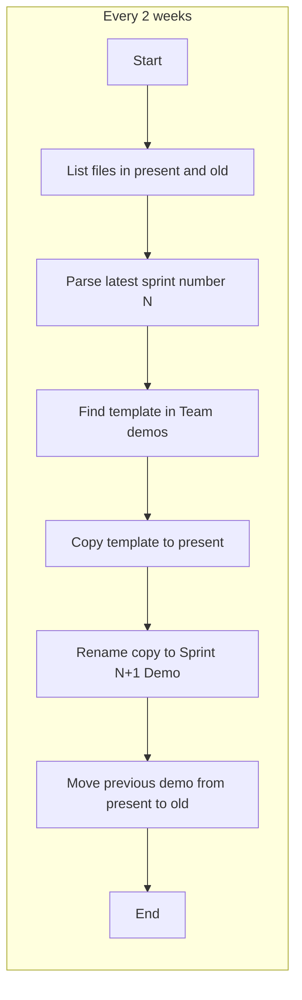
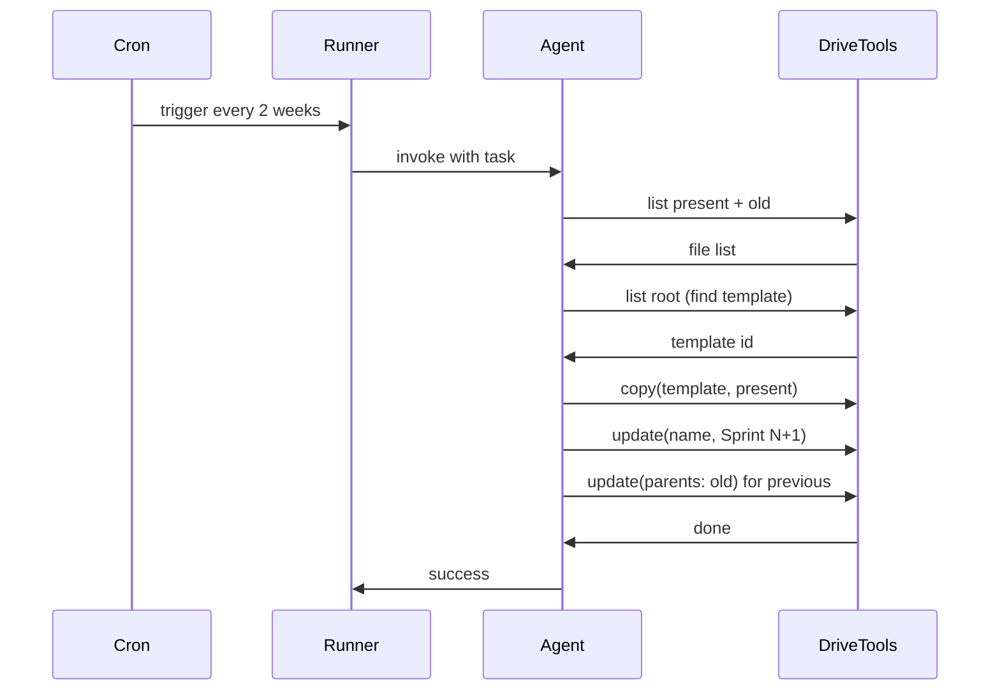

# Sprint Demo Automation with LangGraph Agent

## Target folder structure (assumed)

- **Team demos** (folder ID from your link: `1Hc0BmSGQQn-IX8V_MxJm7fLztnHl3WnZ`)
  - `TEMPLATE for Integration Team Sprint xxx Demo` (template, at root or in Team demos)
  - **present/** — current sprint demo only (e.g. `Integration Team Sprint 306 Demo`)
  - **old/** — previous demos moved here after each run

## High-level flow

1. **List** files in `present/` and optionally in `old/` (to resolve latest N if present is empty).
2. **Parse** latest sprint number from names like `Integration Team Sprint 305 Demo` → N = 305.
3. **Find** template by name pattern `TEMPLATE for Integration Team Sprint ...` in Team demos (root).
4. **Copy** template into `present/` (create copy in folder = present folder ID).
5. **Rename** the new copy to `Integration Team Sprint {N+1} Demo`.
6. **Move** the file that was in `present/` (the previous demo, sprint N) into `old/` (only after the new copy is in place).

Edge case: first run when `present/` is empty — derive N from the highest number in `old/` or from template name; if none, use a config default (e.g. 305).

---

## Architecture

- **LangGraph**: One agent with **tools** that wrap Google Drive operations. The agent is given a single recurring task (“create next sprint demo”) and uses the tools in sequence. Alternatively, a **StateGraph** with fixed nodes (no LLM) is possible and more predictable; recommend starting with tools for flexibility and observability.
- **Google Drive**: Python client (`google-api-python-client` + `google-auth-oauthlib`). Use Drive API v3: `files.list` (with `q` for folder and name filters), `files.copy`, `files.update` (for rename and `parents` for move).
- **Scheduling**: Run the agent **every two weeks** via cron (e.g. `0 9 */14 * *` or a weekday that matches your sprint end) or a small runner that invokes the graph and exits; no need for LangGraph Platform unless you already use it.

---

## Implementation outline

### 1. Google Drive setup

- **Google Cloud project**: Enable Drive API, create OAuth 2.0 credentials (desktop app or service account; service account is better for cron).
- **Scopes**: `https://www.googleapis.com/auth/drive.file` or `drive` if you need full access.
- **Sharing**: If using a service account, share the “Team demos” folder (and subfolders) with the service account email so it can read/write.
- **Config**: Store folder IDs (Team demos, present, old) and template name pattern in env or a small config file.

### 2. Drive tools (Python)

Implement 4–5 functions and expose them as LangGraph/LangChain tools:

- **list_folder(folder_id, name_contains)** — list files in folder, optional name filter. Used for present, old, and root.
- **get_latest_sprint_number()** — list present + old, parse “Integration Team Sprint N Demo”, return max N (and file id of current present demo if any).
- **find_template()** — list Team demos root for name like “TEMPLATE for Integration Team Sprint …”, return file id.
- **copy_file(file_id, new_parent_id, new_name)** — Drive `files.copy` with `name` and `parents`; used to create copy in `present/` with final name (or copy then rename in two steps).
- **move_file(file_id, new_parent_id)** — `files.update` with `addParents`/`removeParents` to move previous demo to `old/`.

Use a shared **Drive service** (built from credentials) so all tools use the same client.

### 3. LangGraph agent

- **Graph**: Use `create_react_agent` (or a minimal StateGraph with a single agent node that can call tools). State: e.g. `latest_sprint`, `template_id`, `previous_demo_id`, `messages` or `steps`.
- **System prompt**: Describe the exact procedure (list → get N → find template → copy to present with name “Integration Team Sprint {N+1} Demo” → move previous from present to old). So the agent “orchestrates” and calls the tools in order.
- **Run**: Single invocation per schedule; no multi-turn user chat. Input: “Create the next sprint demo and archive the previous one.”

### 4. Runner and scheduling

- **Entrypoint**: e.g. `run_agent.py` that loads config, builds the graph, invokes with the fixed task, and logs success/failure.
- **Cron**: Add a job (e.g. `0 9 */14 * *` or your preferred day/time) that runs `python run_agent.py` (with venv and `PYTHONPATH` if needed).
- **Idempotency**: If present already has “Sprint 306” and you run again, agent/tools can detect “latest is 306” and either skip or fail safely; recommend skipping creation and optionally logging “already up to date.”

### 5. Project layout (in `integration-bots`)

- `src/drive/` — Drive client, auth, and tool implementations (`list_folder`, `get_latest_sprint_number`, `find_template`, `copy_file`, `move_file`).
- `src/agent/` — LangGraph graph definition, prompt, and tool binding.
- `run_agent.py` — script that runs the agent once.
- `config.py` or `.env` — folder IDs, template name pattern, default sprint number.
- `requirements.txt` — `langgraph`, `langchain-core`, `google-api-python-client`, `google-auth-oauthlib` (and `python-dotenv` if using .env).

---

## Design decisions

| Decision               | Choice                                | Reason                                                                       |
| ---------------------- | ------------------------------------- | ---------------------------------------------------------------------------- |
| Auth                   | Service account + folder shared to it | Unattended cron; no browser OAuth.                                           |
| Agent vs workflow      | Agent with tools                      | Matches “agent” ask; can later add checks or notifications.                  |
| Where template lives   | Root of Team demos                    | “Mostly the template file will be in folder Team demos”; search there first. |
| Move vs copy for “old” | Move (update parents)                 | One copy stays in old; present holds only current.                           |

---

## Risks and mitigations

- **Template renamed/missing**: Find by name pattern; if not found, fail with a clear error and notify (e.g. log + optional Slack/email later).
- **Present empty first time**: Use max N from `old/` or config default; create first “Integration Team Sprint N Demo” in present.
- **Concurrent run**: Cron interval (2 weeks) makes this unlikely; optional: simple file lock or “last run” check before creating.

---

## Summary

- **Input**: Team demos folder (and subfolders present + old); template in Team demos.
- **Output**: New file in `present/` named “Integration Team Sprint {N+1} Demo”; previous demo moved to `old/`.
- **Trigger**: Cron every two weeks calling a single LangGraph agent run with Drive tools.

No code edits were made; this is a plan only. Next step is to implement in the order: Drive auth + tools → config → agent graph → runner → cron.