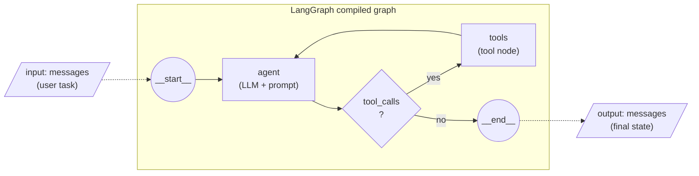
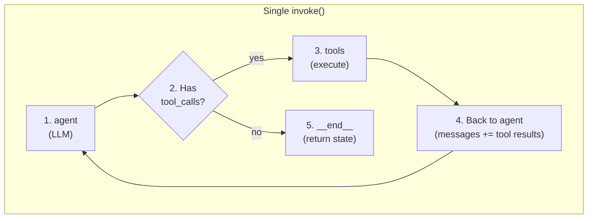
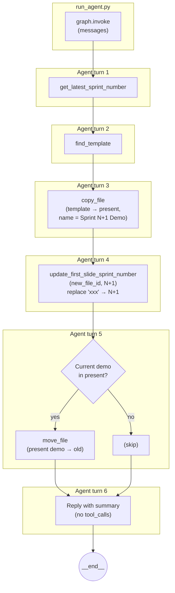

# Flowchart: Sprint Demo Agent (LangGraph Perspective)

## 1. LangGraph ReAct graph structure

The agent is built with `create_react_agent(model, tools, prompt=system_prompt)` from LangGraph’s prebuilt. The compiled graph looks like this:



- **Input:** `{"messages": [HumanMessage("Create the next sprint demo and archive the previous one.")]}`
- **agent:** Invokes the LLM (Gemini/OpenAI/DeepSeek) with the system prompt and current messages. It may return a direct reply or one or more **tool_calls**.
- **Conditional:** If the last message contains `tool_calls`, the graph routes to **tools**; otherwise to **end**.
- **tools:** Runs the requested tools (Drive/Slides API), appends `ToolMessage`(s) to state, and returns to **agent**.
- **Output:** Final `messages` in state (including the agent’s last reply).

---

## 2. Control flow (agent ↔ tools loop)

Same flow as above, drawn as a vertical loop to show the ReAct cycle:



---

## 3. Sprint-demo procedure (intended tool sequence)

This is the **logical** flow the agent is instructed to follow via the system prompt (the actual order may vary slightly depending on the LLM):



---

## 4. End-to-end (runtime view)

From process start to final state:

```mermaid
flowchart TB
    subgraph external ["External"]
        USER["User / cron"]
        ENV[".env\n(config)"]
    end

    subgraph app ["run_agent.py"]
        LOAD["Load config"]
        BUILD["create_graph()"]
        INV["graph.invoke\n(TASK_MESSAGE)"]
        LOG["Log final message"]
    end

    subgraph graph ["create_graph()"]
        DRIVE["get_drive_service()"]
        SLIDES["get_slides_service()"]
        TOOLS["create_drive_tools\n(drive, slides)"]
        REACT["create_react_agent\n(model, tools, prompt)"]
        DRIVE --> TOOLS
        SLIDES --> TOOLS
        TOOLS --> REACT
    end

    subgraph react_loop ["ReAct loop (inside invoke)"]
        A["agent"]
        T["tools"]
        A <--> T
    end

    USER --> LOAD
    ENV --> LOAD
    LOAD --> BUILD
    BUILD --> graph
    BUILD --> INV
    INV --> react_loop
    react_loop --> LOG
```

---

## 5. Tools available to the agent

| Tool | API | Purpose |
|------|-----|--------|
| `get_latest_sprint_number` | Drive | List present/old, compute N, current present file id |
| `find_template` | Drive | Find template file id in Team demos |
| `copy_file` | Drive | Copy template to present with new name |
| `update_first_slide_sprint_number` | Slides | Replace "xxx" with N+1 on first slide |
| `move_file` | Drive | Move previous demo from present to old |
| `list_folder` | Drive | Optional; list files in a folder |

---

## 6. State shape (LangGraph)

- **State:** `{"messages": [...]}` (list of `BaseMessage`: `HumanMessage`, `AIMessage`, `ToolMessage`).
- **Channels:** Messages are appended; each node (agent, tools) reads state and returns updates that get merged (e.g. new messages appended).
- **Conditional edge:** From agent, based on presence of `tool_calls` in the last AIMessage.

You can inspect the compiled graph with:

```python
from src.agent import create_graph
g = create_graph()
print(g.get_graph().draw_ascii())
```
